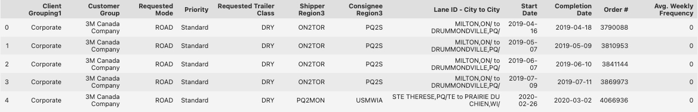
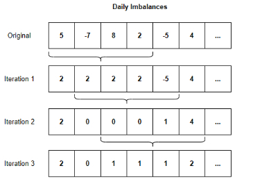
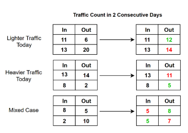
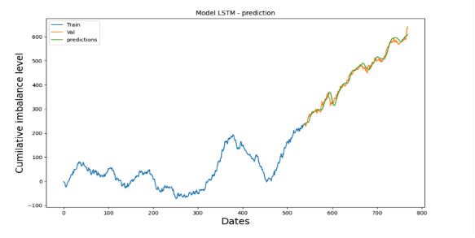
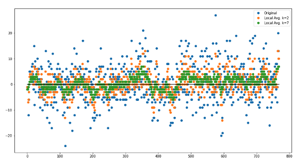
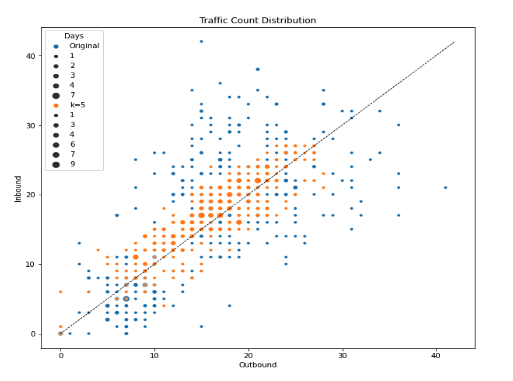

# Bison Transport Nexus Data Challenge 2021

**Our solution was awarded 1st Prize** in the Bison Transport Nexus Data Challenge 2021.

---

## Links
- [Bison Transport Challenge](./Bison_Transport_UManitoba_Challenge.pdf)
- [Solution Report](Report.pdf) 
- [Solution Poster](Poster.pdf)

## The Challenge
- Network imbalances are among the greatest challenges for an irregular route carrier like Bison Transport. 
- The purpose of this challenge is to develop forecasting techniques that will result in improved balance management. The prediction will allow Bison to manage inefficiency and improve profitability. 

## The Dataset

1. Timing properties:
    -  The date and time of **delivery of inbound freight** and the time and date of **shipping of outbound 
    freight** 
    -  The time and date of required delivery versus arrival time of the freight to destination (**slack time 
    between arrival and final delivery**) 
    -  The time and date of **required departure** (does not always match outbound shipping date and time) 
    -  The **transit time required**, based on the intended or actual routing of the shipment 
 
2. Geographic properties: 
    - The **origin region** of the shipment that is inbound to PQ, and the route it takes to arrive in PQ 
    - The **destination region** of the shipment that is outbound from PQ, and the intended route it would 
    take to arrive at destination. 
 
3. Equipment properties : 
    - The **requested trailer type** for any order inbound or outbound from a particular region 
    - The **actual trailer type** of a particular order inbound or outbound from a particular region 
    - The **resident inventory of trailers** in PQ designed to support inbound and outbound freight and asset 
    flow.

## Our Solution
Our solution consist of 2 components: a high accuracy imbalance forecasting algorithm and a schedule optimization algorithm.

- Forecast: We used an LSTM model that can predict future cumulative imbalance level with high accuracy.
    - Observation window: 60 days
    - Sequential() method to build model
    - Dropout 0.2 regularisation
    - Epochs: 50 - 100

- Schedule Optimization: We derived a sliding-window balancing algorithm to balance local freights schedule.
    -  Core Idea: “given a number k, go through every group of k consecutive days and try to even out the imbalances in each of the k days.”
    - We balance any given day by exchanging inbound/outbound orders with the next day, in such a way that it reduces the load of the day with heavier traffic.

    
    

## Results

### 1. LSTM Model

- We observed an accuracy of between 82% and as high as 96% depending on the margin of error during validation.

### 2. Sliding-window schedule balancing algorithm

- The standard deviation in imbalance reduced from 7.2039 to 2.4310 when we apply the rescheduling algorithm  over a k=7 days span
- We also observe that the new inbound - outbound traffic pairs (orange) are closer to the balance line and form a cohesive cluster, signaling fewer extreme variations than the original data set (blue).

## Future Work

- Proving our k local greedy algorithm is near-optimal
- Integrate the 2 methods used to develop a comprehensive solution to the imbalance problem

## Credit and Acknowledgement

Team Members: University of Manitoba's Database and Data Mining Lab
- Jase Tran
- Daniel Mai
- Qi Wen

